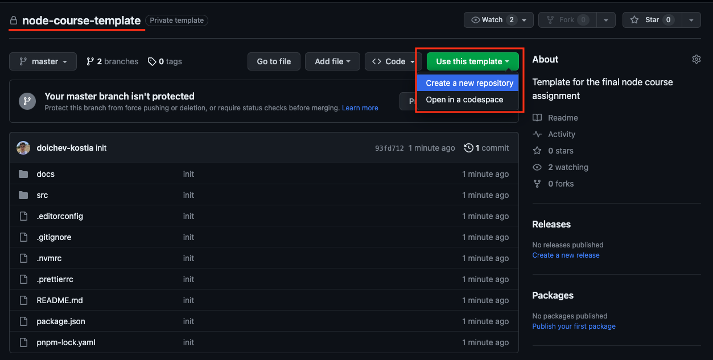
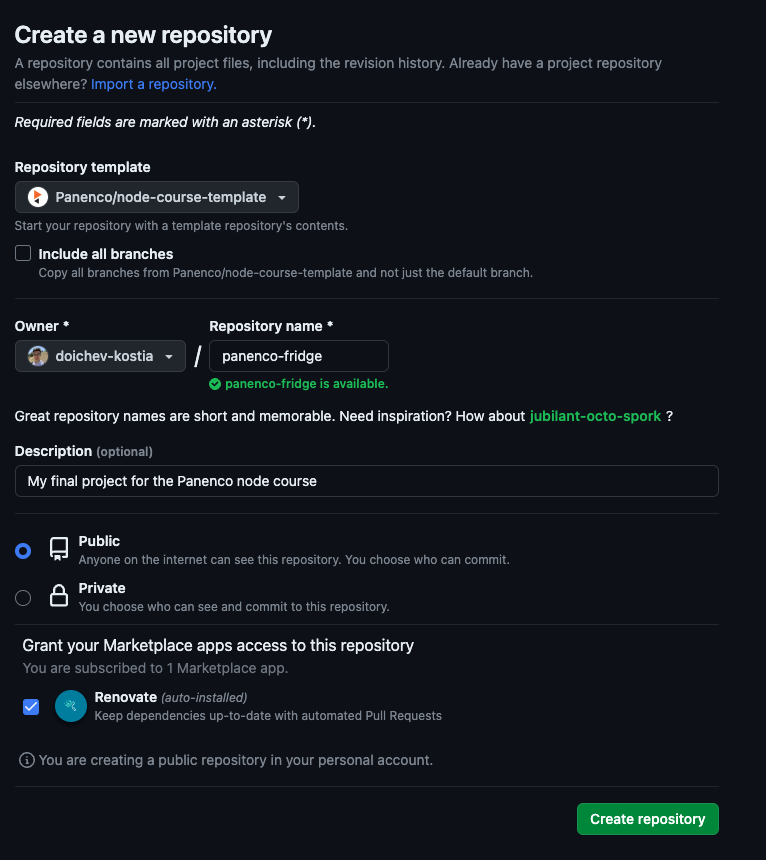
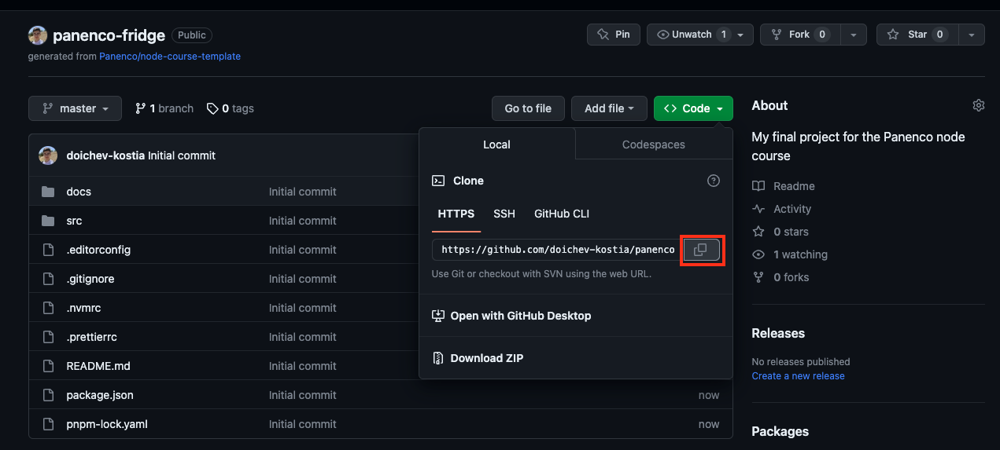

# Node course template

This is a basic template for your final assignment in the Node course.

It contains some code style configurations and can help you get started with the assignment.

## Getting started

1. Create a new repository on GitHub using this repository as a template.





2. Clone your new repository to your computer.



```shell
git clone https://github.com/<your-username>/<your-repo-name>.git
```

3. Checkout to the `develop` branch.

```shell
git checkout -b develop
```

4. Setup your environment according to the guide in [docs/environment-setup.md](./docs/environment-setup.md).
5. Start working on your assignment.
