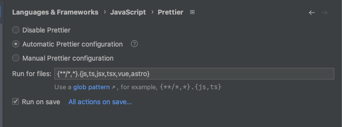

# Environment setup

## Node.js

```shell
nvm use
```

## Install dependencies

```shell
pnpm install
```

## Configure prettier

### VSCode

1. Install the [Prettier - Code formatter](https://marketplace.visualstudio.com/items?itemName=esbenp.prettier-vscode) extension.
2. Follow the configuration guide

### WebStorm

1. Install the [Prettier](https://plugins.jetbrains.com/plugin/10456-prettier) plugin.
2. Open settings and search for `Prettier`
3. Enable the `Automatic Prettier configuration` and `Run on save` options



## Configure StandardJS

Follow the [guide](https://github.com/standard/standard#are-there-text-editor-plugins)

